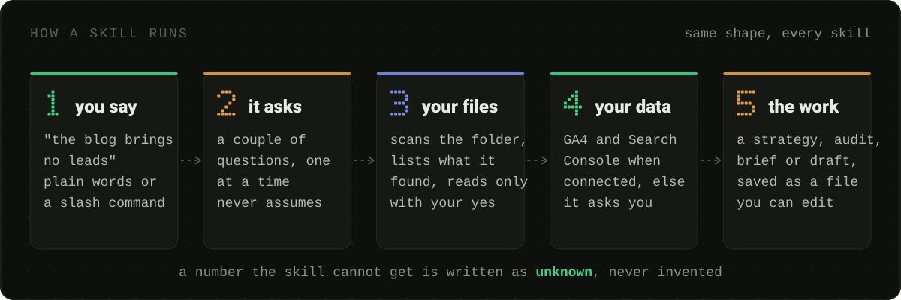
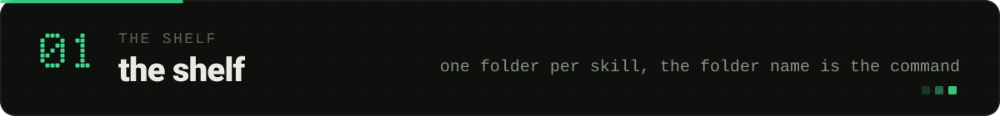
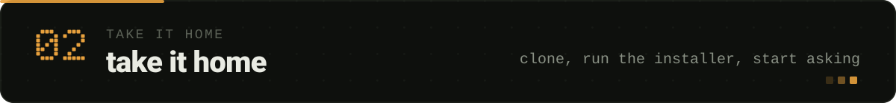
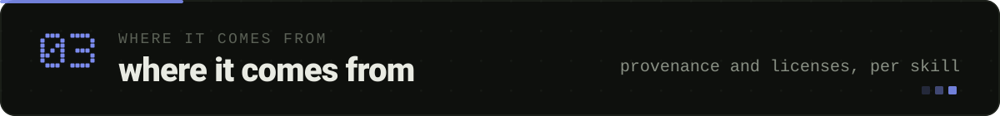
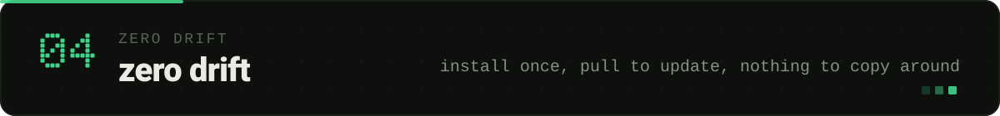
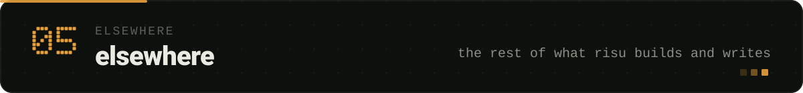

<p align="center">
  
</p>

A working marketer's skill library for Claude Code. Type a slash command, or describe the problem in your own words, and the matching skill asks you a couple of questions, reads your files only when you say yes, and does the work: a 500-page SEO audit, a content strategy with a quarterly plan, a conversion review of the page that isn't converting, a launch plan, a LinkedIn Ads budget, a draft in your voice with the AI tells scrubbed out.

Every skill here runs real marketing work every week. This is not a showcase of skill ideas; it's the toolshed, with the sawdust left in.

**What you can ask**

| You say | It runs |
|---|---|
| "Audit the whole site." | `/seo-audit` crawls up to 500 pages, fans out to specialists, returns a health score |
| "Why isn't this page ranking?" | `/seo-sxo` reads the SERP backwards and finds the intent mismatch |
| "Does ChatGPT cite us?" | `/seo-geo` scores citability for AI Overviews, ChatGPT, Perplexity |
| "How did we do in search this month?" | `/seo-report` pulls live GA4 and Search Console data against Google's guidelines |
| "Our blog doesn't generate leads." | `/content-strategy` builds or audits a 7-part strategy and a 12-piece quarterly hub |
| "What do customers actually say?" | `/customer-research` mines transcripts, reviews, and forums, or runs the interviews |
| "This page isn't converting." | `/cro` returns quick wins, high-impact changes, and test ideas |
| "How much should we spend on LinkedIn?" | `/linkedin-ads` does the budget math and the campaign setup, traps included |
| "This reads like AI wrote it." | `/copy-deslop` checks the copy against the live list of AI-writing tells and fixes it |
| "What would Ogilvy say about this?" | `/marketing-council` seats a simulated board of 12 marketing thinkers and maps where they disagree |

Nothing here needs an API key to start. Connect Google Analytics and Search Console and the data-driven skills switch from asking you for numbers to pulling them.

<p align="center">
  
</p>

<p align="center">
  
</p>

**47 skills, 3 categories.** Each skill is one folder with a `SKILL.md`; the folder name is the slash command.

### Writing — `skills/Writing/`

| Skill | One line |
|---|---|
| `/writing-assistant` | Sparring partner and draft-writer for posts, essays, newsletters; voice profiles, four modes, anti-AI-writing guard built in |
| `/copy-deslop` | Flags and fixes AI-sounding copy against the live Wikipedia "signs of AI writing" list |
| `/copy-longform` | Page-by-page copyedit workflow for long documents, with a tracked edit list that survives session resets |

### SEO — `skills/SEO/`

Two sources side by side: the vendored [claude-seo](https://github.com/AgriciDaniel/claude-seo) suite by [AgriciDaniel](https://github.com/AgriciDaniel) (v2.2.5, MIT, 31 skills in `skills/SEO/claude-seo/`) and one home-grown report skill.

| Skill | One line |
|---|---|
| `/seo` | The router. Reads what you asked for and hands it to the right specialist skills and sub-agents |
| `/seo-audit` | The orchestrator. Crawls up to 500 pages, detects the business type, fans out to up to 15 specialists in parallel, returns a health score |
| `/seo-report` | Own. SEO health report from **live GA4 + Search Console** data against Google's guidelines |

`/seo` and `/seo-audit` delegate to 29 specialist skills and 18 sub-agents: technical, schema, sitemaps, hreflang, images, content quality, GEO for AI search, local and maps, ecommerce, backlinks, and connectors for Google APIs, DataForSEO, Firecrawl, Ahrefs, Bing, and more. Every specialist is also callable on its own (`/seo-technical`, `/seo-schema`, `/seo-geo`, ...) when you want one check without the full fan-out. Full list with one-liners: [`INVENTORY.md`](./INVENTORY.md#tracked-skills) or the [upstream README](https://github.com/AgriciDaniel/claude-seo#readme). The sub-agents live in `skills/SEO/claude-seo/agents/` and `install.ps1` copies them into `~/.claude/agents`; the suite's Python runtime is created once with `claude-seo setup`.

### Marketing Ops — `skills/Marketing-Ops/`

**Strategy and decisions**

| Skill | One line |
|---|---|
| `/content-strategy` | Build or audit an SEO-driven B2B content strategy on the 7-part Orbit Media framework; ends in a quarterly content hub or a ranked gap list |
| `/product-launch` | Launch planning: messaging, assets, distribution, tiered launch systems |
| `/marketing-council` | A simulated board of 12 marketing thinkers (Godin, Ogilvy, Dunford, Sharp, Hormozi, ...) argues your decision from their documented frameworks and maps where they disagree |

**Research**

| Skill | One line |
|---|---|
| `/customer-research` | Three modes: extract signal from transcripts and tickets, mine public reviews and forums, or run interviews and surveys; outputs JTBD, pains, triggers, and the customer's own words |

**Conversion**

| Skill | One line |
|---|---|
| `/cro` | Audits a page or form for conversion: value proposition, headline, CTA hierarchy, trust, objections, friction; returns quick wins, big changes, and test ideas |
| `/lead-magnets` | Picks the problem, format, and distribution for a gated offer that leads naturally to the product |

**Reporting** (HubSpot + GA4; company and CRM ids come from a per-client context pack, never from the skill)

| Skill | One line |
|---|---|
| `/marketing-monthly` | The marketing page of a board pack: pipeline value, MQL, leads, traffic vs last month, quarter progress with sparklines, traffic by campaign, per-lead journeys; locked format across editions |
| `/campaign-report` | One campaign's pipeline + content + funnel for leadership: a manual lead sweep reconciled three ways against the CRM, two funnels never blended, destination-dated conversions, edition deltas, a board takeaway |
| `/pipeline-analysis` | RevOps diagnostic over any period: a stdlib Python engine computes flow and diagnosis planes, cohort vs throughput conversion, failure modes A–F with owner and value, and a reverse-funnel to the revenue target |

**Paid**

| Skill | One line |
|---|---|
| `/linkedin-ads` | B2B LinkedIn Ads co-pilot: budget math, targeting, campaign setup traps, thought-leader and conversation ad copy |

**Presence**

| Skill | One line |
|---|---|
| `/beautify-github-readme` | Turns a repository README into a cohesive visual story; every marketer has a GitHub in 2026 |
| `/frontend-design-anti-slop` | Builds or reviews web UI with real design taste; a named anti-pattern list for the generic AI look (purple gradients, rounded-xl, "Transform your X") |

### What's in the repo

A skill folder holds its `SKILL.md`, and a `references/` folder when the skill needs depth it
shouldn't carry in its prompt.

```
marketing-skills/
├── skills/
│   ├── Writing/
│   │   ├── copy-deslop/            SKILL.md
│   │   ├── copy-longform/          SKILL.md + references/
│   │   └── writing-assistant/      SKILL.md + references/
│   ├── SEO/
│   │   ├── claude-seo/             31 skills vendored from AgriciDaniel/claude-seo
│   │   │   ├── seo/                the router, plus scripts, schema and the Python runtime
│   │   │   ├── seo-audit/          the orchestrator
│   │   │   ├── seo-technical/  seo-geo/  seo-schema/  …27 more specialists
│   │   │   └── agents/             18 sub-agents, copied to ~/.claude/agents by the installer
│   │   └── seo-report/             SKILL.md + references/
│   └── Marketing-Ops/
│       ├── beautify-github-readme/     content-strategy/     cro/
│       ├── customer-research/          frontend-design-anti-slop/
│       ├── lead-magnets/               linkedin-ads/         marketing-council/
│       ├── marketing-monthly/          campaign-report/      product-launch/
│       └── pipeline-analysis/          SKILL.md + definitions.md + compute_funnel.py + tests + references/
├── assets/readme/                  hero, section headers, social preview
│   └── archive/                    superseded heroes with their sources
├── brand/                          the visual system
│   └── source/                     generators for every asset above
├── docs/
│   └── data-connections.md         GA4 + Search Console MCP setup
├── install.ps1                     link skills into ~/.claude/skills (Windows)
├── install.sh                      the same, on macOS and Linux
├── INVENTORY.md                    per-skill source, license and provenance
├── LICENSE                         MIT
└── NOTICE                          which license covers which folder
```

**Company context, every skill the same way.** Skills that need to know about your company (`/content-strategy`, `/linkedin-ads`, `/seo-report`, `/cro`, `/customer-research`, `/lead-magnets`, `/marketing-council`, and the three reporting skills) never assume a folder layout. They scan the folder you launched from, list what they found, and ask: use these, point me elsewhere, paste the context, or start with none. Nothing is read until you say so. Machine-local `*.local.md` files are an optional extra and never ship.

<p align="center">
  
</p>

Claude Code discovers skills one folder deep under `~/.claude/skills`. This repo nests them by category, so the installer links each skill into place.

**The whole library**

```powershell
git clone https://github.com/risukisu/marketing-skills D:\marketing-skills
D:\marketing-skills\install.ps1          # junctions into ~\.claude\skills, agents into ~\.claude\agents
```

```bash
git clone https://github.com/risukisu/marketing-skills ~/marketing-skills
~/marketing-skills/install.sh            # symlinks into ~/.claude/skills, agents into ~/.claude/agents
```

Pass `-Copy` / `--copy` for plain copies instead of links, `-Uninstall` / `--uninstall` to remove them. Re-run after pulling to pick up new skills. For the SEO suite, run `"$HOME/.claude/skills/seo/bin/claude-seo" setup` once to create its Python runtime.

**One skill**: copy its folder; each skill is self-contained.

```powershell
Copy-Item -Recurse .\skills\Writing\copy-deslop "$env:USERPROFILE\.claude\skills\copy-deslop"
```

Plugin-based skills (Superpowers, Vercel) are not in this repo; they install through the plugin marketplace.

**Live data, optional.** `/seo-report`, `/seo-google`, and the data hooks in `/content-strategy` and `/cro` read Google Analytics 4 and Search Console through two local MCP servers: Google's [analytics-mcp](https://github.com/googleanalytics/google-analytics-mcp) and Suganthan Mohanadasan's [GSC MCP](https://github.com/Suganthan-Mohanadasan/Suganthans-GSC-MCP). Neither is vendored here. Install steps, `.mcp.json` snippets, tested versions, and the two-accounts note are in [`docs/data-connections.md`](./docs/data-connections.md). Every skill still works without them; it asks for numbers instead.

<p align="center">
  
</p>

Not everything on the shelf was built here, and the shelf says so.

| Source | Skills | License | Notes |
|---|---:|---|---|
| Own (risu) | 8 | Root MIT | Company context is gathered per run, never stored in the repo |
| [AgriciDaniel/claude-seo](https://github.com/AgriciDaniel/claude-seo) v2.2.5 | 31 | MIT | LICENSE.txt kept in the folder, plus a prompt-injection hardening layer added here |
| [coreyhaines31/marketingskills](https://github.com/coreyhaines31/marketingskills) | 4 | MIT | LICENSE kept in each folder, credit inline, adapted to the per-run context rule |
| [oil-oil/beautify-github-readme](https://github.com/oil-oil/beautify-github-readme) | 1 | MIT | LICENSE kept in the folder |

Frameworks credited inline where a skill encodes someone's method: Andy Crestodina / Orbit Media (`/content-strategy`), AdConversion (`/linkedin-ads`), Luke Harries (`/product-launch`), Corey Haines (`/cro`, `/customer-research`, `/lead-magnets`, `/marketing-council`).

Per-skill source, license text and provenance notes live in [`INVENTORY.md`](./INVENTORY.md).

<p align="center">
  
</p>

Skills are plain text files, and plain text files get copied around and forgotten. This library is built so that can't happen to you:

1. **One place.** Every skill lives in this repo, in a folder you can read and diff. The installer links each one into `~/.claude/skills`, so the file Claude Code runs is the file in the repo.
2. **Updates are a pull.** `git pull`, re-run the installer, done. No re-copying, no "which version do I have".
3. **Your edits survive.** Change a skill through its link and the change lands in the repo, versioned. Fork it and your fork is the library.

<p align="center">
  
</p>

| Where | What |
|---|---|
| [skillcraft.cloud](https://skillcraft.cloud) | SkillCraft, a marketplace for marketing skills like these |
| [risu.pl](https://risu.pl) | the blog: notes on marketing, AI and building things |
| [abialas.pl](https://abialas.pl) | who I am and what I do for a living |
| [linkedin.com/in/andrzej-bialas](https://www.linkedin.com/in/andrzej-bialas/) | the professional side, and where I post most |

---

<p align="center">
  <sub>MIT for the skills written here (see <a href="./LICENSE">LICENSE</a>). Vendored skills keep their upstream licenses; <a href="./NOTICE">NOTICE</a> has the per-folder map. ☕</sub>
</p>
